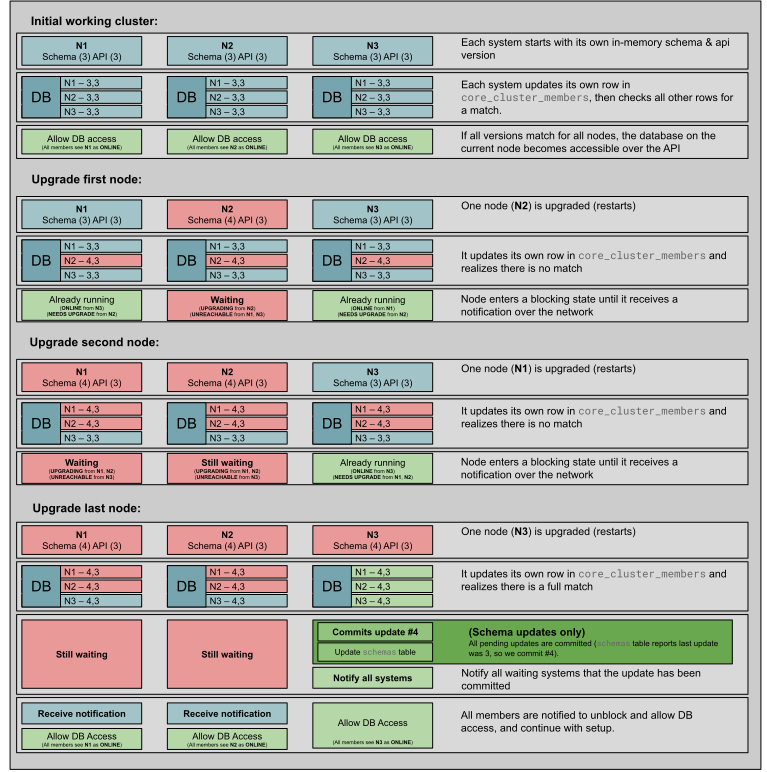

# Upgrading Microcluster

When a new build of a project that uses Microcluster introduces logical changes such as a schema update or API extensions, Microcluster coordinates upgrading to this new build in the manner described below.

## Schema updates

The [app.Start function](https://github.com/canonical/microcluster/blob/v3/microcluster/app.go#L69-L92) accepts as an argument a list of functions that are run in sequence. These functions supply a database transaction that can be used to extend or modify the schema of the Dqlite database used by Microcluster. The order of the functions in this list must not change. New updates must be added to the end of the list, in the order to be executed.

A schema version is maintained per cluster member, representing the sum-total of updates that the member is locally aware of.

### Example

```go
// SchemaExtensions is a list of schema extensions that can be passed to the MicroCluster daemon.
// Each entry will increase the database schema version by one, and will be applied after internal schema updates.
var SchemaExtensions = []schema.Update{
	schemaAppend1,
	schemaAppend2,
}
```

You can see this code in use within [the example package](https://github.com/canonical/microcluster/blob/v3/example/database/extended_schema.go#L11-L16).

## API extensions

The [app.Start function](https://github.com/canonical/microcluster/blob/v3/microcluster/app.go#L69-L92) accepts as argument a `[]string` that is interpreted as an ordered list of labels corresponding to changes to the API. Do not change the order of this list.

### Example

```go
// These are the extensions that are present when the daemon starts.
var extensions = []string{
	"custom_extension_a_0",
	"custom_extension_a_1",
}

// Extensions returns the list of MicroOVN extensions.
func Extensions() []string {
	return extensions
}
```

You can see this code in use within [the example package](https://github.com/canonical/microcluster/blob/v3/example/api/extensions.go).

## Upgrade behavior

To ensure consistent behavior across the cluster, schema updates are only committed to the database once all members' expected schema versions are consistent.

To upgrade to a new build that includes new schema updates or API extensions, each cluster member's Microcluster service must be restarted after the build. Each cluster member will enter a waiting state until all members have encountered the same updates.

Running cluster members that have not been upgraded will not be affected by a pending upgrade, and will continue to function. However, they will not be able to communicate with any members that are waiting for an upgrade to be committed.

Cluster members that have not been upgraded cannot be restarted while an upgrade is in progress. The cluster member must either be upgraded, or all members waiting for the upgrade to be committed must revert to the previous version.

* On members that have not been upgraded, [client.GetClusterMembers](https://github.com/canonical/microcluster/blob/4d80df396e335bf26f9895956e846e082bb8f624/internal/rest/client/cluster.go#L40-L49) will report [UNREACHABLE](https://github.com/canonical/microcluster/blob/4d80df396e335bf26f9895956e846e082bb8f624/rest/types/cluster.go#L47) for any members that have encountered an upgrade and are waiting.

* On upgraded members, before the upgrade is committed, [client.GetClusterMembers](https://github.com/canonical/microcluster/blob/4d80df396e335bf26f9895956e846e082bb8f624/internal/rest/client/cluster.go#L40-L49) will report [UPGRADING](https://github.com/canonical/microcluster/blob/4d80df396e335bf26f9895956e846e082bb8f624/rest/types/cluster.go#L56) for all waiting members, and [NEEDS UPGRADE](https://github.com/canonical/microcluster/blob/4d80df396e335bf26f9895956e846e082bb8f624/rest/types/cluster.go#L59) for all members that have not been upgraded.

## Example schema upgrade

The following example performs a schema upgrade on a 3-member cluster, incrementing the schema version by 1. Adding additional API extensions would result in the same behavior.


